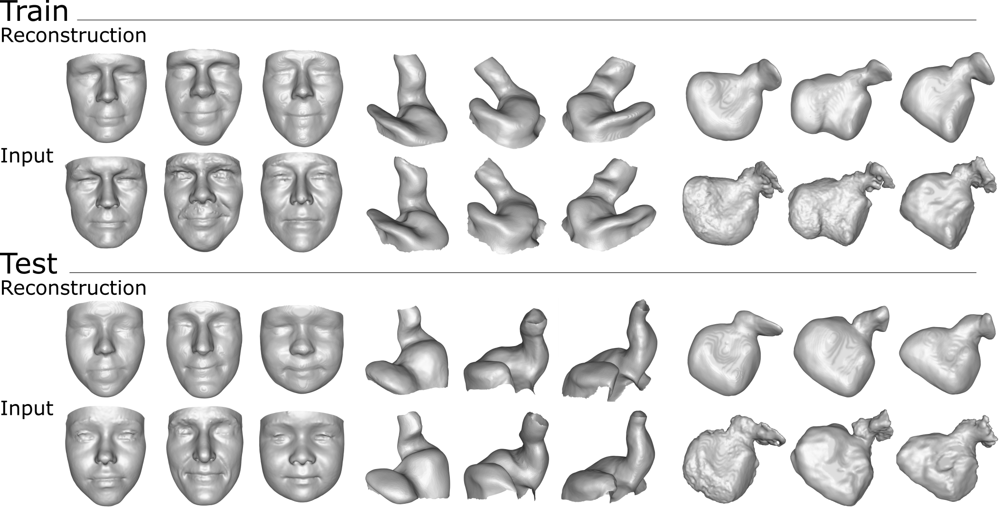

# Implicit-Neural-Distance-Representation-of-Complex-Anatomie
Repository linked to publication: Implicit Neural Distance Representation for Unsupervised and Supervised Classification of Complex Anatomies (Accepted for MICCAI2021).

Authors: Kristine Aavild Juhl, Xabier Morales, Oscar Camara, Ole de Backer and Rasmus Reinhold Paulsen

[](img/reconstruction.png)

# Prepare training data
The preprocessing is a fully pythonic pipeline taking .vtk files as input and outputting arrays of point-coordinates and distances to be used for training. 
Meshes that are to be aligned using a set of pre-computed anatomical landmarks can be processed running:
```
python data_generator/make_train_data_LM.py
```
Meshes that should be aligned using iterative closest point without prealignment can be processed running:
```
python data_generator/make_train_data_LM.py
```

The following changes should be made in the respective files to preprocess your own dataset:
- l. 17: True/False indicates if the data should be prealigned
- l. 21: A list of fileids should be saved in a .txt file and the filepath should be specified.
- l. 22: A fileid should be given as the template for rigid alignemnt 
- l. 43-47: Specify filepaths for the processed data
- l. 135+151 / 110+126: Specify the scale_factor so that the largest mesh fits the unit-sphere (number can be found by running l. 133 after aligning all shapes)
- l. 178+179 / 153+154: Set standard deviation on noise pertubation of sampling points

To visualize the mesh and the sampled points run 'check_trainingdata'. 

The data is split into a training, validation and test set defined in the split files (see example of such files in examples/splits/XXX.json). 

# Train autodecoder model
This part of the code is largely based on deepSDF (https://github.com/facebookresearch/DeepSDF). Please see and cite this code for additional details on code organization etc.
Parameters of training are stored in a "specification file" in the experiment directory. (See example in 'Experiments/Examples/specs.json'). 
The training is initiated as follows: 
```
python train.py -e <experiment_directory> -c <optional: continue_from_epoch_number>
```

# Find latent vectors from trained model and reconstruct unsigned distance field: 
When a model is trained it can be used to generate latent codes for unknown shapes and to reconstruct the input mesh from code. 
```
python reconstruct.py -e <experiment_directory> -c <checkpoint_number> -d <path_to_data> -s <split_file>
```
It is also possible to reconstruct a mesh with a known latent code (ie. interpolations in the latent space). 
A .pth file should be saved in '<experiment_directory>/reconstruction_from_latentcode/Codes/<latent_name>.pth'. 
```
python reconstruct_from_latent_code.py -e <experiment_directory> -c <checkpoint_number> -d <path_to_data> -s <split_file>
```

# Investigate latent space:

**Visualize latent space:**

The following script loads and visualize the latent vectors of the three datasets using PCA and tSNE as dimensionality reduction
```
python visualize_latentspace.py
```

**Cluster latent vectors (unsupervised):**

The following scripts loads the latent vectors and performs K-means clustering of the latent vectors. 
```
python unsupervised_clustering.py
```

**Train supervised classification model: **

The following script trains and test a simple neural network learning the gender based on the self-optimized latent vectors
```
python supervised_classification.py
```

# Reconstruct mesh from UDF
A mesh is extracted from the UDF by running:
```
python mesh_UDF.py
```
The method is dependent on the MRFSurface software which can be downloaded at http://www.imm.dtu.dk/~rapa/software.html
